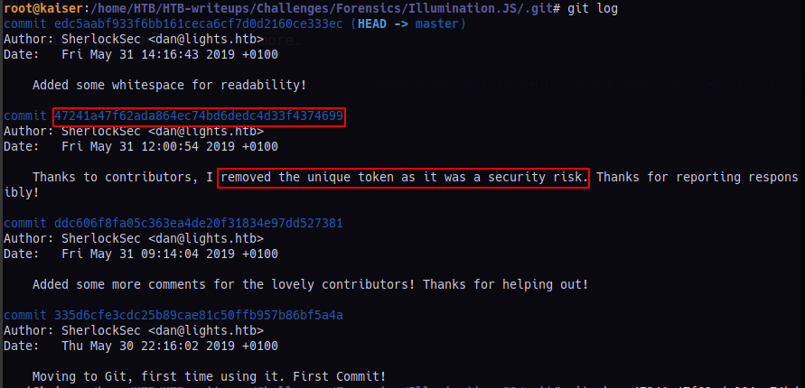

# Illumination

### Challenge Author(s): [SherlockSec](https://www.hackthebox.eu/home/users/profile/50344)

### Description: 
    A Junior Developer just switched to a new source control platform. Can you find the secret token? 
### Difficulty: `Easy`
---
# Challenge

Unzippping the given zip we are given 2 files **bot.js** and **config.json**.       

We look for any hidden files or folders and we find a .git meaning we can find the changes made in these files from the moment they were first pushed.      

Let's look into the **bot.js** file.   
```javascript
client.login(Buffer.from(config.token, 'base64').toString('ascii')) //Login with secret token
```
Looking at this line we can see that its taking data from the **config.json** file. for the secret token.

But opening the **config.json** file we are shown this 
```javascript
	"token": "Replace me with token when in use! Security Risk!",
	"prefix": "~",
	"lightNum": "1337",
	"username": "UmVkIEhlcnJpbmcsIHJlYWQgdGhlIEpTIGNhcmVmdWxseQ==",
	"host": "127.0.0.1"
```

The token was replaced, but luckily git stores different versions of the repo, so we maybe we can findout what it initially consisted.      

To check the different versions
```bash
$ cd .git
$ git log
```
We find 4 commits but one of the commit messages shows us that they removed the security token.         


So we check that commit to see what changes they made.      
```bash
$ git show 47241a47f62ada864ec74bd6dedc4d33f4374699
```

We find the secret token, it looks like its encoded, from the **bot.js** file we know that its base64 encoded. So, we use [CyberChef](https://gchq.github.io/CyberChef) to decode it.        

Voila! we have our flag.