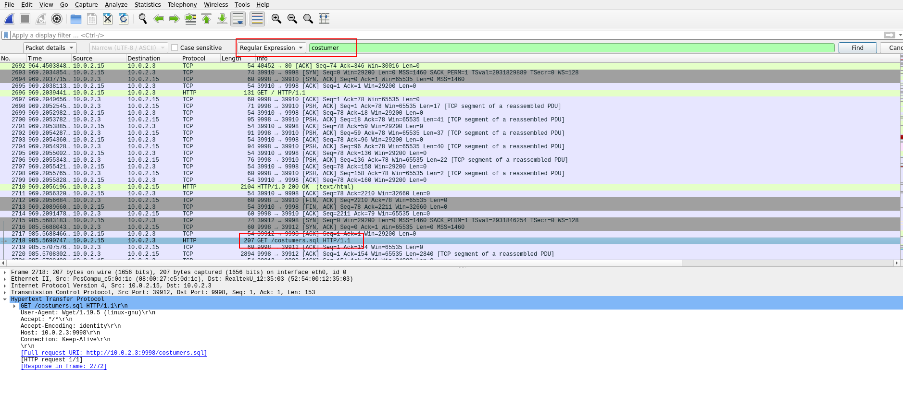
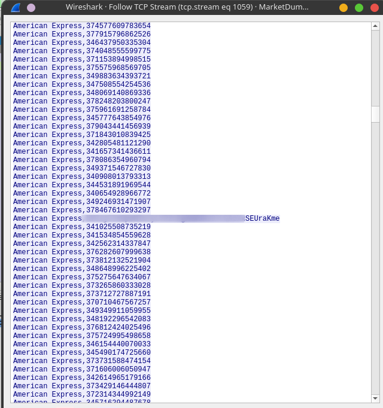
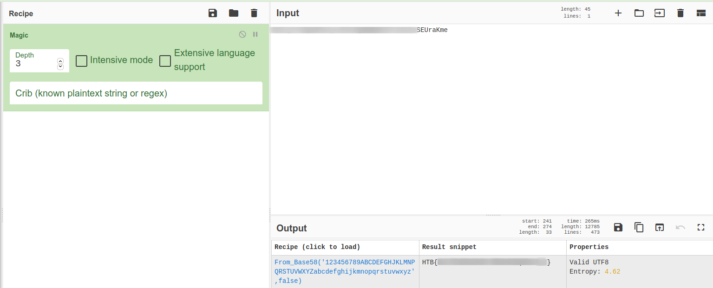

# MarketDump

### Challenge Author(s): [butrintkomoni](https://app.hackthebox.eu/users/41604)

### Description: 
    We have got informed that a hacker managed to get into our internal network after pivoiting through the web platform that runs in public internet. He managed to bypass our small product stocks logging platform and then he got our costumer database file. We believe that only one of our costumers was targeted. Can you find out who the customer was?
### Difficulty: `Medium`
---
# Challenge

Unzipping the given zip file we find a pcap file, so we open it in WireShark.

In the description it is given as a costumer database file was stolen it looked weird coz he spelled it ryt at the end of the description.      
So I searched for the expression `costumer` in the file.

You can right click on it and follow the tcp stream.

You'll find a large row of American Express numbers, If you scroll down you'll find one out of place number.

This here is our encrypted flag.

We can use [cyberchef](https://gchq.github.io/CyberChef/) to decode this string.

We can just use the Magic operaion and it'll decode itself.

and Voila! We have our flag.
