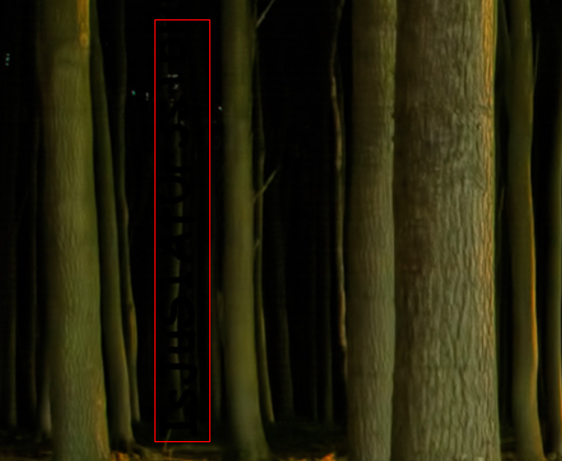
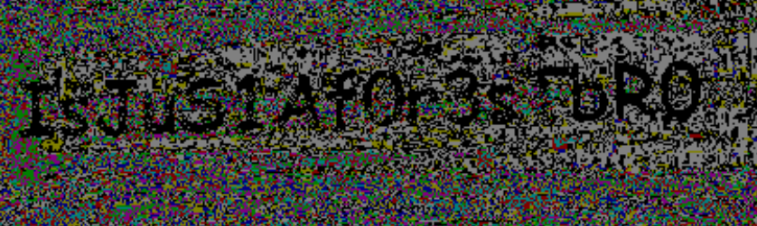
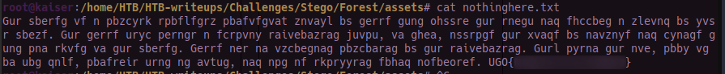
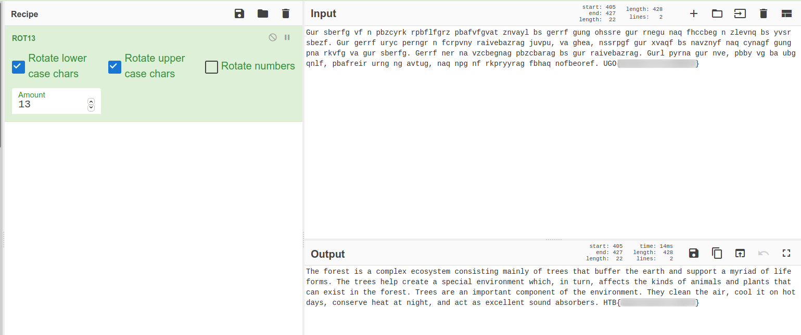

# Forest

### Challenge Author(s): [pwn4magic](https://app.hackthebox.eu/users/119)

### Description: 
    Explore the forest and capture the flag!
### Difficulty: `Medium`
---
# Challenge

Unzipping the given zip file we find an image, so i tried to run it through a steagnography too; but nothing came out.  
I even tried out `strings` and `hexdump` to find something. 

Finally I used `steghide` and it was prompting for a password.

So reading the description again, I thought I'll just look at the plain image aimlessly and then there was something that looked like text on the top left of the image.


It doesn't look that clearly in here.       

So I used this [online tool](https://incoherency.co.uk/image-steganography/#unhide) to look at it more clearly and it came up to this and it looked like the password needed.



Now we try to use steghide again with this as password.

```bash
$ steghide extract -sf forest.jpg
```

We see that the data is extracted to `nothinghere.txt` 

It somehow painstakingly looks like a caesar's cipher.

So we use [cyberchef](https://gchq.github.io/CyberChef/) to decode it.


Voila! we have our flag.