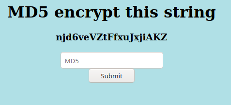
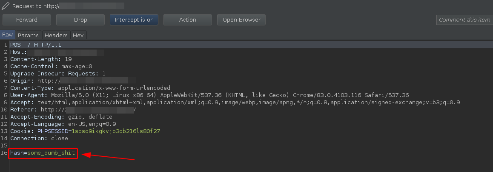
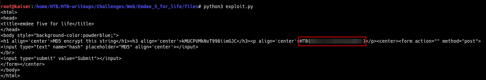

# Emdee five for life

### Challenge Author(s): [L4mpje](https://www.hackthebox.eu/home/users/profile/29267)

#### Description: Can you encrypt fast enough?
#### Difficulty: Easy

# Challenge

Looking up the given ip we are face with the following      



I tried to manually encrypt into MD5 through [cyberchef](https://gchq.github.io/CyberChef/) and submit but it was too slow. 
    
Then I realized we have to use a script which can read the string encrypt it and then submit it, what better to use than python for webscraping.        

I googled for some time on what to use and found the BeautifulSoup library was the best and easiest to strip html.      

We understood how to get string from yhe HTML page let's see how to submit it.      

For this fireup BurpSuite and click on submit to see what data is being sent.           

        

From BurpSuite we can see that our submission is being sent as a POST request.      
Also we can see a PHPSESSIONID which means we can't just submit some random encrypted md5 hash.         

So we use requests.session() to get the cookie.     
From BeautifulSoup we can get the string from the page and use hashlib for encryption.  
```(python)
str = soup.h3.string
hash = hashlib.md5(str.encode()).hexdigest()
```    
Don't forget to print the response to get your flag

My python script is [here](files/exploit.py)

And we finally run it.      

```
$ python3 exploit.py
```

