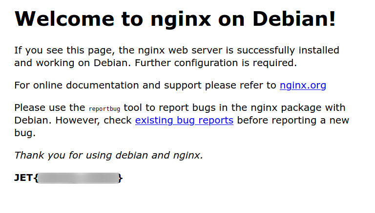
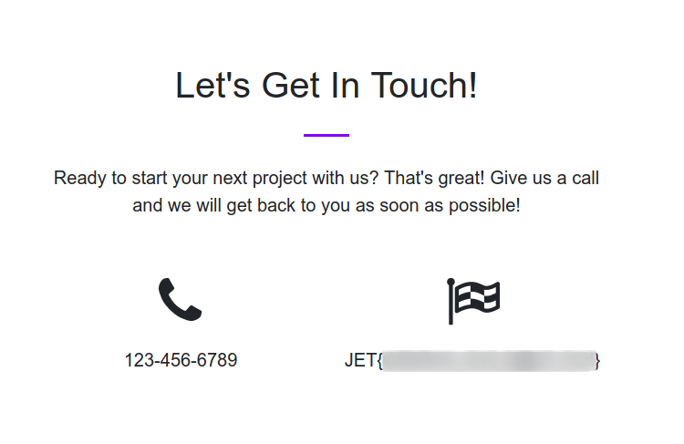
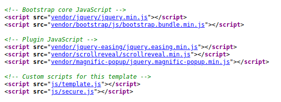
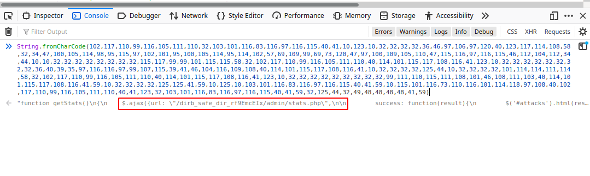

# Jet

### Description: 
    Lift off with this introductory fortress from Jet! Featuring interesting web vectors and challenges, this fortress is perfect for those getting started.

### Entry point: 
    10.13.37.10    
### Flags   : `11`
### Points : `100`
---
## **Connect**

You have to download a separate vpn pack to connect to the Fortress labs. You can get it from the access page.

After firing up the vpn you can visit the entry point from a browser and you'll find the first flag,



You can go ahead and submit this flag and it'll update your progress.   

---

## **Digging in...**

After reading a ton of OSCP blog posts, I wanted try out autorecon.

From the results we can see 5 ports are open 22, 53, 80, 5555, 7777.

I tried opening the 5555 and 7777 in the browser which was a pretty dumb attempt.   

After playing around I couldn't find much in this website, I went to the forum to get some clues.

I did a reverse DNS query on the server using
```bash
dig @10.13.37.10 -x 10.13.37.10 
```

We find 2 URL's     
- www.securewebinc.jet
- securewebinc.jet

We can't visit these sites in the normal way, for them to be recognized add them to the /etc/hosts file.

```nano /etc/hosts```

add this line 10.13.37.10 www.securewebinc.jet securewebinc.jet

and now visiting the first site, we find our 2<sup>nd</sup> flag in the footer.



The second site is the same default site


## **Going Deeper**

Checking the whole source code of this site we find a secure.js file at the end of it.  
    
Opening it we find a function which we can execute in the console.  


Going to the admin directory we find a login page.      

Checking the source code on this page to we find another flag.

## **Bypassing Authentication**
