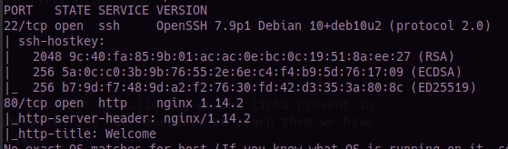
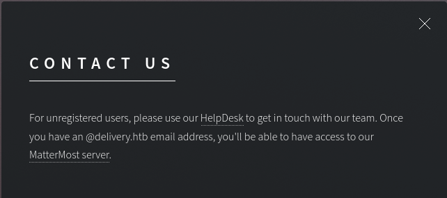
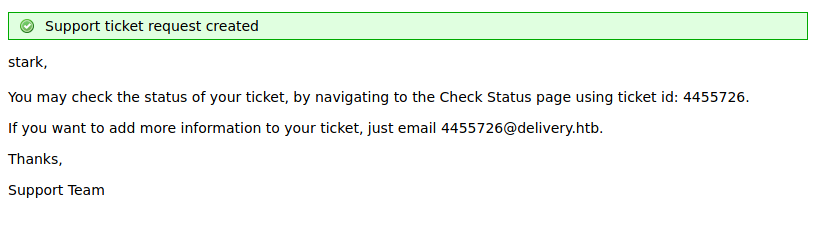
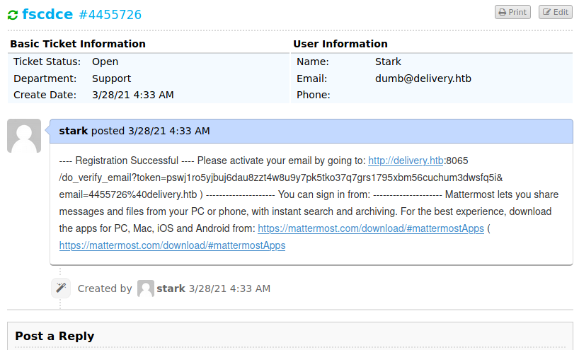
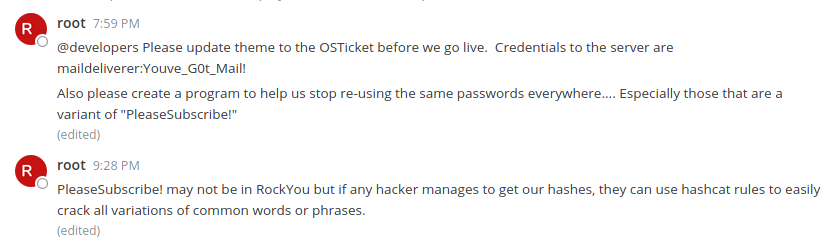
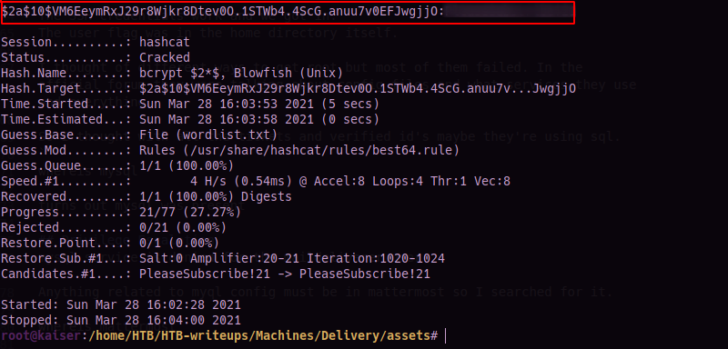
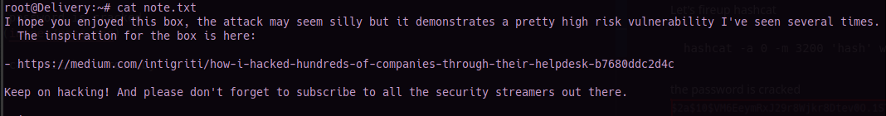

# Delivery
### Machine Maker(s): [ippsec](https://www.hackthebox.eu/home/users/profile/3769)

#### Info :
``` 
OS          : Linux
Difficulty  : Easy
Points      : 20
Release     : 09 Jan 2021
IP          : 10.10.10.222
```
---
## Enumeration
As always lets scan the machine first using nmap
```
nmap -A 10.10.10.222
```


Nothing interesting came up in the scan.

So we go to the website and find a "contact us", clicking on the links present in there leads .delivery.htb pages, which are not reachable to reach them we have to add them to our /etc/hosts file
```
$ sudo nano /etc/hosts
```
add this line to the file for it to reach these pages.
```
10.10.10.222 delivery.htb helpdesk.delivery.htb 
```

The help desk has 2 links
* MatterMost
* HelpDesk (some kind of ticket system)

Let's check MatterMost

To create an we need a verification mail so I used a throwaway accaount but didn't seem to receive any verification.

Looking back at contact us page 



It tells us to to get in touch with HelpDesk and that only when we have a @delivery.htb email address we can use MatterMost.

Let's check the HelpDesk and see if we can find anything.   
It says that a valid email address is required to open a ticket. Let's try with a throwaway account, It didn't work.

## Foothold

No other kind of mail was working to open a ticket, so I used a fake mail with @delivery.htb and it worked we got ourselves a a valid mail to contact to along with a ticket id.



We can check the ticket in the **check ticket status** tab

Lets use the contact mail to register ourselves on MatterMost as whatever is sent to that mail will be added to the ticket we might get the verification link in the ticket status.

After registering and getting the prompt of verify your mail, check the ticket status.      
You can find the verification mail along with the link.


After logging in we can see a bunch of convos along with a set of SSH credentials.

The SSH credentials work and we got in.
The user flag was in the home directory itself.

I thought of different ways to get root but most of them failed. In the official forum they were talking about config files and what services they use and everything.

So I thought with all the tickets and verified id's maybe they're using sql.
```
whereis mysql
```
turns out mysql was present

## Privilege Escalation
mysql service is denied for the maildeliverer user

Anything related to myql config must be in mattermost so I searched for it.
```
whereis mattermost
```

It was in the opt directory and contained a config.json file.
Reading it we find out the credentials mysql service.

We log in using
```
mysql -u user -D mattermost
```

We can display the user and password of all users in the **Users** table
```
SELECT username, password from Users;
```
We can see a bunch of users along with root whose passwords are hashed we can use hashcat to decrypt them.      
After looking up `$2a$10$` we find out its a BCrypt hash.

Remembering the convos from the MatterMost site it doesn't look like we can use rockyou.txt as always.


They are talking about some hashcat rules, so i searched for them.

We're going to add PleaseSubscribe! in a text file and use it as a wordlist.txt

It turns out hashcat has existing rules files in  `/usr/share/hashcat/rules`

Let's fireup hashcat

```
hashcat -a 0 -m 3200 'hash' wordlist.txt -r /usr/share/hashcat/rules/best64.rule
```
the password is cracked


You can switch to root by
```
su
```
enter the password when prompted.

and Voila we are `root`

You can find the root flag in the root directory.


A liitle note from the man, ippsec, himself.
